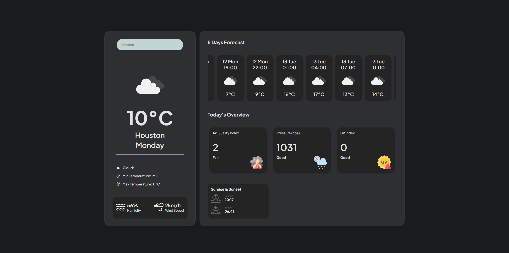

# Forecast App


## Contains basic functionality:

Web:
https://weather-app-six-ochre-64.vercel.app/

- Forecast by user geolocation.
- Search forecast by city name.

<picture>
    
</picture>

## Basic commands for running project:

```
git clone https://github.com/NikitaPlamenevskiy/weather_app.git
npm install
npm start
```
